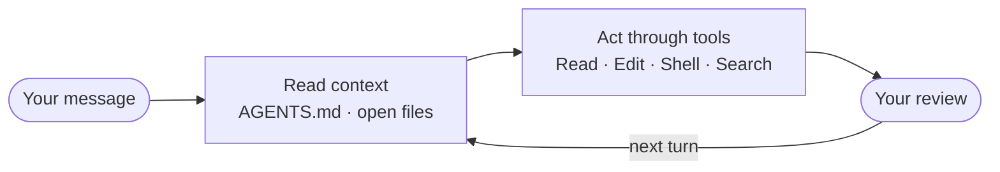

# Start Here — the three-minute version

*Read this while you are getting set up.*

---

## What you are doing today

You are the support lead at Nussaa, a food delivery app in Riyadh. Someone has handed you a quarter of customer complaints and asked what the themes were.

Two hundred tickets. Arabic, English, and both at once. Some useless, some duplicated. Your job is a report that says what went wrong and how often.

You will not write code. You will direct an agent, read what it proposes, correct it through files, and check the result.

Then you will do the part almost nobody teaches: **turn that whole workflow into a Skill, so next quarter takes ten minutes instead of a morning.**

> By the end you can take a folder of messy real work, direct the Antigravity CLI to research, analyse and produce a finished artifact from it, then turn that workflow into something that repeats. And you can prove it works, because you tested it in a clean context.

---

## The one mental model that matters

`agy` is not a chat box in a terminal. It is a loop:



The part people miss is the first box. The agent re-reads your rules files **on every single turn**, not just at the start.

That has one practical consequence, and it is the thing to carry into the next three hours:

> **You steer it by editing files, not by arguing in chat.**

A correction you type into the conversation dies with the session. The same correction written into `AGENTS.md` gets read every turn, forever. When it does the wrong thing today, your first instinct should be *which file is wrong?* rather than *how do I re-word this?*

---

## Everything is a file in a folder

This is the shortcut for the whole day. Four things you will meet, and every one of them is a file:

| Piece | Where it lives |
|---|---|
| Rules — how you work | `AGENTS.md` |
| Skill — a job it knows how to do | `.agents/skills/<name>/SKILL.md` |
| Subagent — a clean pair of eyes | `.agents/agents/<name>.md` |
| Plugin — the bundle you hand a teammate | `.agents/plugins/<name>/` |

Nothing today is configured through a settings UI, and nothing is magic. If you can edit a text file, you can steer this.

---

## Plan Mode, in one line

Type `/plan`, or start the session with `agy --mode plan`. The agent writes you a numbered plan instead of doing the work.

You read the plan and push back before approving. Catching a mistake in a plan costs a sentence.

---

## Two things about this CLI that surprise people

**It asks before it runs commands.** A lot of its reading happens through shell commands, so you will approve `ls` and `cat` calls before it gets moving. That is the tool showing you its hands. Approve them and carry on.

**It asks whether to trust the folder.** The first launch in a new directory asks. Say yes for `nussaa/`. That answer is the outer edge of what it can reach.

---

## The three claims we are testing

You will watch each one happen rather than take it on trust.

1. **Do the work once, then keep it.** Getting a good answer out of an AI is not the hard part any more. Getting the same answer next quarter, without re-explaining yourself, is.
2. **You cannot test your own instructions.** You were there when you wrote them, so you read straight past the step that only makes sense if you remember the conversation. Something with no memory has to try it.
3. **Give it the reach the task needs.** You will see what this agent does when it cannot find a folder, and what stops it. Then you will watch it get handed exactly one capability on purpose.

---

## Before we start, check two things

```bash
agy --version     # prints a version number
agy models        # lists what your account can reach
```

The second one is the real check — it only answers once you are signed in with an eligible account. Red? Say so now, not at minute forty.

[← Back to home](index.html)
